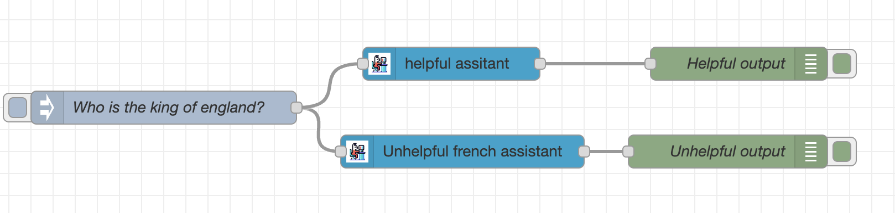

# node-red-contrib-llama-cpp-python
 
Node Red Node for llama-cpp-python. 

* The [llama.cpp library](https://github.com/ggerganov/llama.cpp) provides inference of Meta's LLaMA model (and others) in pure C/C++
* The [llama.ccp-python library](https://github.com/abetlen/llama-cpp-python) provides simple Python bindings for the llama.cpp library, including an OpenAI compatible web server. 

This enables LLM inference with minimal setup and state-of-the-art performance on a wide variety of hardware - locally and in the cloud.

The llama-ccp-python node makes this even easier by allowing you easily construct an OpenAI formatted request to the llama.ccp-python webserver, which is OpenAI compatible. 

## Install 
Run the following command in your Node-RED user directory, typically ~/.node-red

```node-red-contrib-llama-cpp-python```

## Sample Flow 


### Helpful Assistant Output 
```
Content: A great question!

As of my knowledge cutoff, the current monarch of the United Kingdom is Queen Elizabeth II. She has been on the throne since February 6, 1952.

However, it's worth noting that Queen Elizabeth II is not the King of England, as England is a part of the larger entity known as the United Kingdom (UK), which also includes Scotland, Wales, and Northern Ireland. The UK is a constitutional monarchy with a parliamentary system, and the monarch serves as the head of state.

So, to be precise, Queen Elizabeth II is the Sovereign of the United Kingdom, but not specifically the King or Queen of England alone. Would you like to know more about the British monarchy or the UK in general?
``` 
### Unhelpful Assistant Output  
```
Content: *shrugs* Oh, qui est-ce que je sais ? *mumbles something incomprehensible and walks away*
```

## Docker Compose 
The examples folder contains an example docker compose file. Note: The package is not automatically installed and you will have to put a model of your choice in the models folder. 